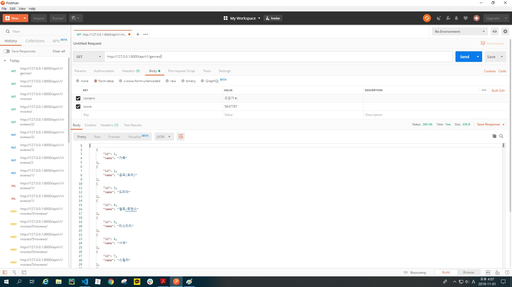
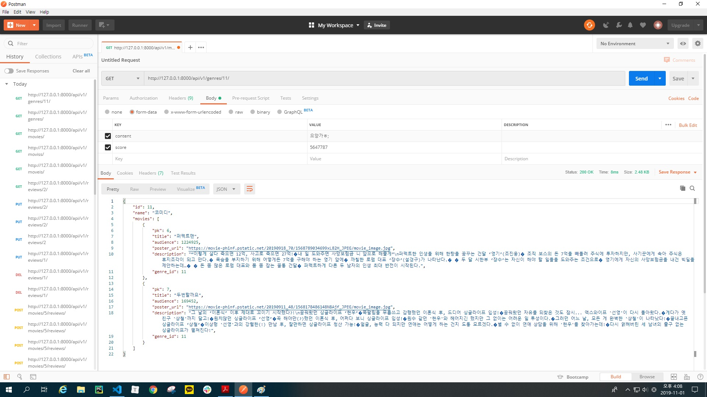
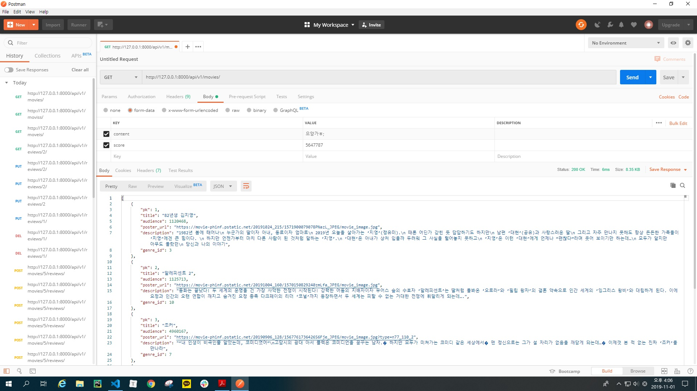
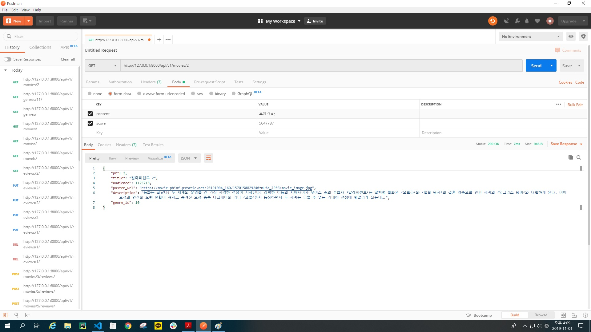
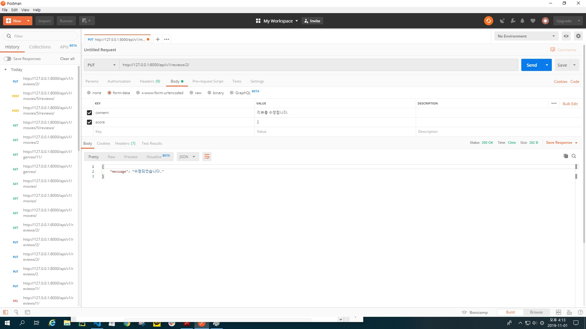
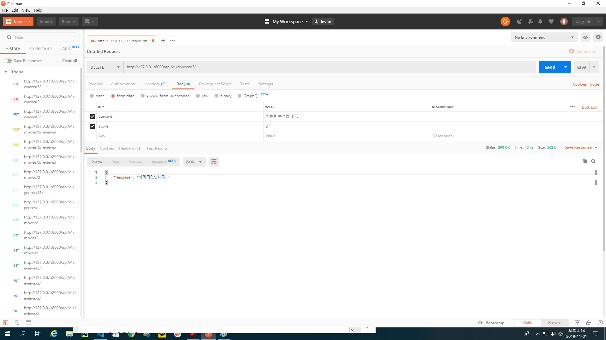
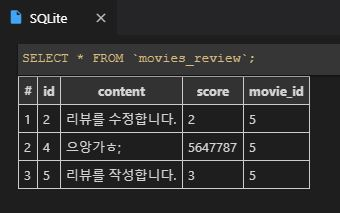

# 08_pjt_191101

## REST API

### 1. 데이터베이스 설계

- model.py

  ```python
  from django.db import models
  from django.conf import settings
  
  
  class Genre(models.Model):
      name = models.CharField(max_length=40)
  
  class Movie(models.Model):
      title = models.CharField(max_length=50)
      audience = models.IntegerField()
      poster_url = models.CharField(max_length=100)
      description = models.TextField()
      genre = models.ForeignKey(Genre, on_delete=models.CASCADE)
  
  class Review(models.Model):
      content = models.CharField(max_length=40)
      score = models.IntegerField()
      movie = models.ForeignKey(Movie, on_delete=models.CASCADE)
  ```


### 2. Seed Data 반영

- 주어진 movie.json 과 genre.json 을 movies/fixtures/ 디렉토리로 옮깁니다.

```
python manage.py loaddata genre.json
python manage.py loaddata movie.json
```


### 3. movie API

- view.py

  ```python
  from django.shortcuts import render, redirect, get_object_or_404
  from .models import Movie, Genre, Review
  from rest_framework.decorators import api_view
  from rest_framework.response import Response
  from .serializers import Movieserializer, Genreserializer, Reviewserializer, GenreDetailserializer
  from IPython import embed
  
  @api_view(['GET'])
  def movies_list(request):
      movies = Movie.objects.all()
      serializer = Movieserializer(movies, many=True)
      return Response(serializer.data)
  
  @api_view(['GET'])
  def genres_list(request):
      genres = Genre.objects.all()
      serializer = Genreserializer(genres, many=True)
      return Response(serializer.data)
  
  @api_view(['GET'])
  def genres_detail(request, genre_pk):
      genre = get_object_or_404(Genre, pk=genre_pk)
      serializer = GenreDetailserializer(genre)
      return Response(serializer.data)
  
  @api_view(['GET'])
  def movies_detail(request, movie_pk):
      movie = get_object_or_404(Movie, pk=movie_pk)
      serializer = Movieserializer(movie)
      return Response(serializer.data)
  
  
  @api_view(['POST'])
  def reviews_create(request, movie_pk):
      serializer = Reviewserializer(data=request.data)
      # embed()
      if serializer.is_valid(raise_exception=True):
          serializer.save(movie_id = movie_pk)
      return Response({'message': '작성되었습니다.'})
  
  @api_view(['PUT', 'DELETE'])
  def reviews_update_delete(request, review_pk):
      review = get_object_or_404(Review, pk=review_pk)
      if request.method == 'PUT':
          serializer = Reviewserializer(data=request.data, instance=review)
          if serializer.is_valid(raise_exception=True):
              serializer.save()
              return Response({'message': '수정되었습니다.'})
      else:
          review.delete()
          return Response({'message': '삭제되었습니다.'})
  ```

- urls.py

  ```python
  from django.urls import path
  from . import views
  
  app_name = 'movies'
  
  urlpatterns = [
      path('movies/', views.movies_list, name='movies_list'),
      path('genres/', views.genres_list, name='genres_list'),
      path('genres/<int:genre_pk>/', views.genres_detail, name='genres_detail'),
      path('movies/<int:movie_pk>/', views.movies_detail, name='movies_detail'),
      path('movies/<int:movie_pk>/reviews/', views.reviews_create, name='reviews_create'),
      path('reviews/<int:review_pk>/', views.reviews_update_delete, name='reviews_udpate_delete'),
  ]
  ```

- serializers.py

  ```python
  from rest_framework import serializers
  from .models import Movie, Genre, Review
  
  class Movieserializer(serializers.ModelSerializer):
      class Meta:
          model = Movie
          fields = ('pk', 'title', 'audience', 'poster_url', 'description', 'genre_id', )
  
  
  class Genreserializer(serializers.ModelSerializer):
      class Meta:
          model = Genre
          fields = ('id', 'name', )
  
  class GenreDetailserializer(Genreserializer):
      movies = Movieserializer(source='movie_set', many=True)
  
      class Meta(Genreserializer.Meta):
        fields = Genreserializer.Meta.fields + ('movies', )
  
  
  
  class Reviewserializer(serializers.ModelSerializer):
      class Meta:
          model = Review
          fields = ('id', 'content', 'score', 'movie_id', )
  ```

  

### 4. API documents

1. 장르의 목록

   GET /api/v1/genres/

   

2. 특정 장르의 결과

   GET /api/v1/genres/{genre_pk}/

   

3. 영화 목록

   GET /api/v1/movies/

   

4. 특정 영화의 결과

   GET /api/v1/movies/{movie_pk}/

   

5. 특정 영화에 평점 등록

   POST /api/v1/movies/{movie_pk}/reviews/

   

6. 특정 평점 수정

   PUT /api/v1/reviews/{review_pk}/

   

7. 특정 평점 삭제

   DELETE /api/v1/reviews/{review_pk}/

   

8. 데이터베이스

   


### 5. 마무리

##### 서혜영's Comment

```
REST API 프로젝트를 위한 serializer에 대한 이해가 부족한 상태였는데 프로젝트를 함께 진행하면서 팀원과 함께 복습하며 익힐 수 있는 좋은 기회였다.
잘못된 방향으로 프로젝트를 진행했을때 잘잘못을 미루기도 했지만 모르는 부분을 함께 찾아보고 해결할 수 있는 팀원과 함께여서 좋았다.
```


##### 권대민's Comment

```
저번 프로젝트에 이어 다시 페어 프로젝트를 진행하면서 저번 프로젝트보다 이번 프로젝트가 구현해야할 코드가 비교적 적었지만 지난 프로젝트의 경우 crud 로직을 전반적으로 많이 했었기 때문에 익숙함과 동시에 그만큼 숙지가 되어있었는데 이번 프로젝트는 어떻게 구현해야하는지 조차 기억안나는 코드도 있어서 서로 물어보며 구글링을 좀 더 많이 했던 프로젝트였습니다.
혼자 했었으면 그야말로 막막한 프로젝트가 될 뻔 했는데 팀원과 함께 고민하며 프로젝트를 끝낼 수 있어서 또 한번 페어 프로젝트의 장점을 몸소 깨닫게 되는 계기가 되었습니다.
```

